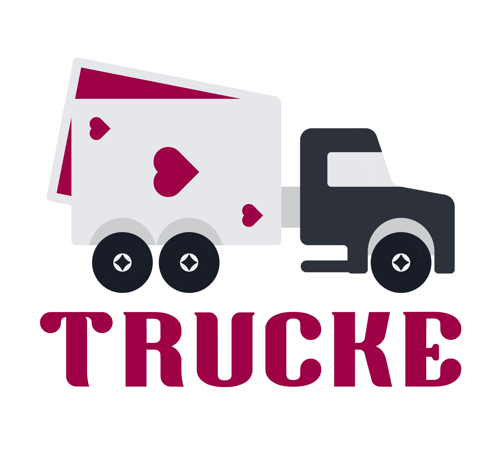

# Trucke

  

O Trucke é uma solução que melhora o acompanhamento da saúde do(a) caminhoneiro(a), a fim de diagnosticar e tratar distúrbios e comorbidades o mais cedo possível para evitar complicações médicas e acidentes decorrentes de sono e distração: sintomas diretos da apneia. Por meio de uma plataforma gamificada, garantimos que os caminhoneiros além de realizar consultas médicas de rotina, retornarão aos postos para fazer o acompanhamento da sua saúde. Assim, colaboramos para a criação de uma cultura de saúde preventiva entre os principais usuários das estradas brasileiras. 
